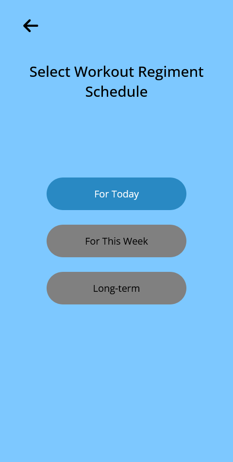
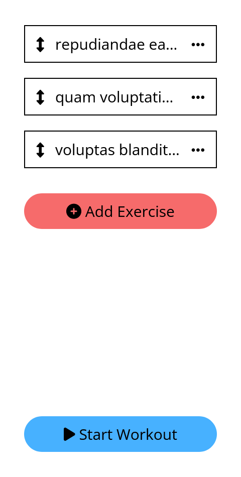
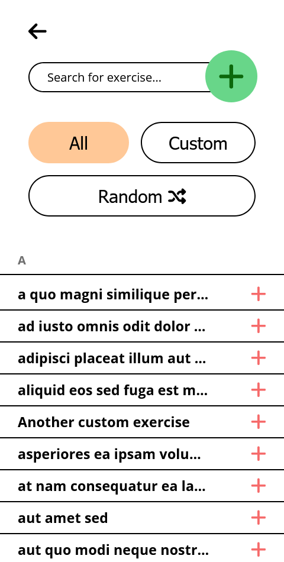
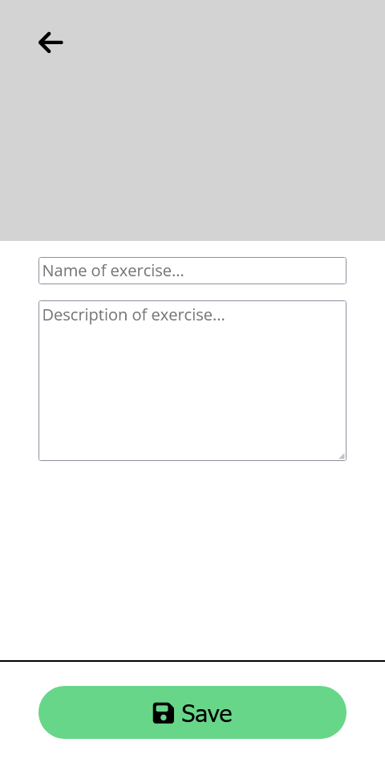
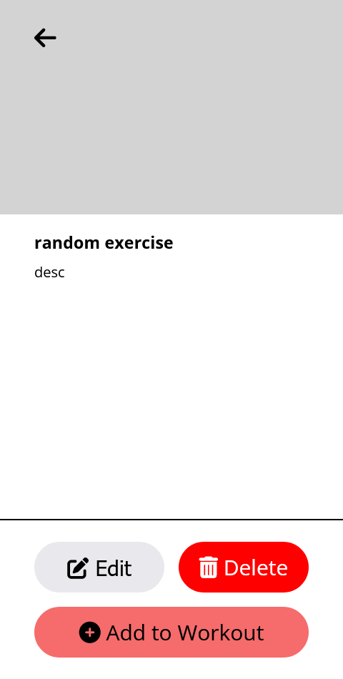

# Road to Gymnastics

Road to Gymnastics is a fitness app that will get an individual ready to for gymnastics. Currently it is in development with the use of a sample API and in need of major changes in the UI (currently a temporary UI is being used). The app is capable of generating a workout regiment randomly, a unique feature for fitness apps.

## Table of contents

- [Overview](#overview)
  - [The challenge](#the-challenge)
  - [Screenshot](#screenshot)
  - [Links](#links)
- [My process](#my-process)
  - [Built with](#built-with)
  - [Continued development](#continued-development)
  - [Useful resources](#useful-resources)
- [Author](#author)

## Overview

### The challenge

Users should be able to:

- Generate a workout regiment that is unexpected to provide their muscles with muscle confusion to optimize physical results

### Screenshot

### Links

- Live Site URL: [Road to Gymnastics](https://road-to-gymnastics.netlify.app/assets/pages/workout-startup-page1.html)

## My process

### Built with

HTML, CSS, JavaScript, Firebase

### Continued development

- [ ] Fetch data from a real API
- [ ] Make the UI better
- [ ] Make the UX more explicit
- [ ] Replace the current drag-and-drop feature with a JS library
- [ ] Make a product dashboard page for desktop view

### Useful resources

- [How to make draggable elements](https://www.javascripttutorial.net/web-apis/javascript-drag-and-drop/) - This helped me in learning how to make elements in the DOM draggable.

- [How to make a search bar](https://www.youtube.com/watch?v=TlP5WIxVirU&t=319s) - This video taught me the basics on how to make a search bar.

- [Writing to DOM while fetching data](https://stackoverflow.com/questions/13364613/how-to-know-if-window-load-event-was-fired-already) - This helped me solve the problem of "load" events while fetching data asynchronously.

- [How to Host Bundled Site on Netlify](https://www.youtube.com/watch?v=3HUI1EQS9sA) - This provided me with some clues on how to go about hosting this site to Netlify. Needed an `index.html` file in the root of the directory and made that redirect to the start-up page for the app—a work-around to get the app deployed.

## Author

- Website - [Urvish Patel](https://urvish-patel.netlify.app/)
- [Blog site](https://urvsworld.hashnode.dev/) 

